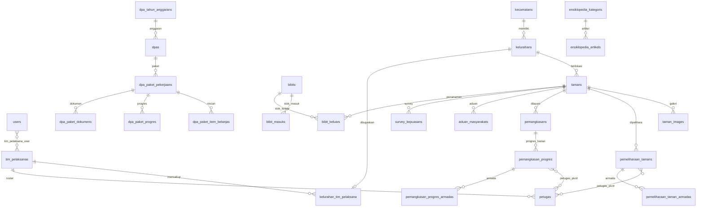

# Rancangan Desain Basis Data SIMTAMAN

**Sistem Informasi Manajemen Pertamanan**  
Disperakimtan Kota Batam · Versi 1.0 · September 2026

---

## 1. Pendahuluan

### 1.1 Tujuan Dokumen

Menjelaskan struktur basis data SIMTAMAN: entitas, relasi, atribut kunci, dan aturan integritas untuk mendukung pengembangan, maintenance, dan audit sistem.

### 1.2 DBMS

| Lingkungan | Engine |
|------------|--------|
| Development | SQLite 3 |
| Production | MySQL 8.x / MariaDB 10.6+ |

### 1.3 Konvensi Penamaan

- Tabel: plural snake_case (`pemeliharaan_tamans`)
- Primary key: `id` (BIGINT UNSIGNED AUTO_INCREMENT)
- Foreign key: `{model}_id`
- Timestamp: `created_at`, `updated_at` (Laravel convention)
- Soft delete: tidak digunakan (hard delete + audit log)

---

## 2. Diagram Relasi Entitas (ERD)

### 2.1 Domain Utama



### 2.2 Arsitektur Data (Layer)

```
┌─────────────────────────────────────────────────────────────┐
│  REFERENSI & ORGANISASI                                     │
│  kecamatans · kelurahans · tim_pelaksanas · petugas · users │
└──────────────────────────┬──────────────────────────────────┘
                           │
┌──────────────────────────▼──────────────────────────────────┐
│  MASTER ASET RTH                                            │
│  tamans · taman_images · rth_kategoris · pejabats · kota_profiles │
└──────────────────────────┬──────────────────────────────────┘
                           │
        ┌──────────────────┼──────────────────┐
        ▼                  ▼                  ▼
┌───────────────┐  ┌───────────────┐  ┌───────────────┐
│ OPERASIONAL   │  │ MASYARAKAT    │  │ BIBIT         │
│ pemeliharaan  │  │ aduan         │  │ bibits        │
│ pemangkasan   │  │ survey        │  │ masuk/keluar  │
│ alat_sarana   │  │               │  │               │
└───────────────┘  └───────────────┘  └───────────────┘
        │
        ▼
┌─────────────────────────────────────────────────────────────┐
│  MONITORING ANGGARAN (DPA) · ENSIKLOPEDIA · AUDIT           │
└─────────────────────────────────────────────────────────────┘
```

---

## 3. Katalog Tabel

### 3.1 Autentikasi & Pengguna

#### `users`

| Kolom | Tipe | Keterangan |
|-------|------|------------|
| id | BIGINT PK | |
| name | VARCHAR | Nama lengkap |
| email | VARCHAR UNIQUE | Login |
| password | VARCHAR | bcrypt hash |
| role | ENUM | `admin`, `operator`, `viewer` |
| akses_semua_wilayah | BOOLEAN | Operator lintas wilayah |
| email_verified_at | TIMESTAMP NULL | |
| remember_token | VARCHAR NULL | |

#### `tim_pelaksana_user` (pivot)

| Kolom | Tipe | Keterangan |
|-------|------|------------|
| user_id | FK → users | |
| tim_pelaksana_id | FK → tim_pelaksanas | |

---

### 3.2 Wilayah & Organisasi

#### `kecamatans`

| Kolom | Tipe | Keterangan |
|-------|------|------------|
| id | BIGINT PK | |
| nama | VARCHAR | Nama kecamatan |
| kode_kemendagri | VARCHAR NULL | Kode BPS |

#### `kelurahans`

| Kolom | Tipe | Keterangan |
|-------|------|------------|
| id | BIGINT PK | |
| kecamatan_id | FK → kecamatans | |
| nama | VARCHAR | Nama kelurahan |

#### `tim_pelaksanas`

| Kolom | Tipe | Keterangan |
|-------|------|------------|
| id | BIGINT PK | |
| nama | VARCHAR UNIQUE | Contoh: Tim Wilayah 1 |
| nama_pengawas | VARCHAR NULL | |
| memiliki_wilayah_kerja | BOOLEAN | false = Tim Nursery/Armada |
| aktif | BOOLEAN | |
| urutan | INT | Urutan tampilan |

#### `kelurahan_tim_pelaksana` (pivot)

| Kolom | Tipe | Keterangan |
|-------|------|------------|
| kelurahan_id | FK UNIQUE | Satu kelurahan → satu tim |
| tim_pelaksana_id | FK | |

#### `petugas`

| Kolom | Tipe | Keterangan |
|-------|------|------------|
| id | BIGINT PK | |
| tim_pelaksana_id | FK → tim_pelaksanas | |
| nama | VARCHAR | Nama petugas lapangan |
| jabatan | VARCHAR NULL | Mandor, sopir, dll. |
| is_inti | BOOLEAN | Legacy (tidak dipakai UI) |
| is_pengawas | BOOLEAN | Flag pengawas |
| aktif | BOOLEAN | |
| urutan | INT | |

---

### 3.3 Master RTH / Taman

#### `tamans`

| Kolom | Tipe | Keterangan |
|-------|------|------------|
| id | BIGINT PK | |
| nama_taman | VARCHAR | |
| kategori | ENUM | Taman Kota, Taman Lingkungan, Jalur Hijau, TPU, Kebun Raya |
| kelurahan_id | FK NULL → kelurahans | Wilayah |
| luasan | DECIMAL NULL | m² |
| alamat | TEXT NULL | |
| latitude, longitude | DECIMAL NULL | Koordinat WGS84 |
| deskripsi | TEXT NULL | |
| fasilitas | JSON NULL | Daftar fasilitas |
| foto | VARCHAR NULL | Foto utama |
| tahun_pembangunan | YEAR NULL | |
| nilai_pembangunan | DECIMAL NULL | |
| kontraktor | VARCHAR NULL | |
| konsultan_perencana | VARCHAR NULL | |
| status_data | ENUM | `lengkap`, `belum_lengkap` |
| data_verified_at | TIMESTAMP NULL | Verifikasi terakhir |

#### `taman_images`

| Kolom | Tipe | Keterangan |
|-------|------|------------|
| id | BIGINT PK | |
| taman_id | FK → tamans | ON DELETE CASCADE |
| path_foto | VARCHAR | Path relatif storage |

---

### 3.4 Operasional Pertamanan

#### `pemeliharaan_tamans`

| Kolom | Tipe | Keterangan |
|-------|------|------------|
| id | BIGINT PK | |
| tanggal | DATETIME | Waktu pelaksanaan |
| tim | VARCHAR | Nama tim pelaksana |
| taman_id | FK NULL → tamans | NULL jika lokasi manual |
| lokasi_pelaksanaan | VARCHAR NULL | Lokasi di luar master taman |
| jumlah_personil | INT NULL | Auto dari petugas terpilih |
| hari_ke, total_hari | INT NULL | Progress multi-hari |
| persentase_progres | DECIMAL NULL | |
| uraian_pekerjaan | TEXT NULL | |
| foto_1 … foto_6 | VARCHAR NULL | Dokumentasi foto |

#### `pemeliharaan_taman_petugas` (pivot)

| Kolom | Tipe | Keterangan |
|-------|------|------------|
| pemeliharaan_taman_id | FK | |
| petugas_id | FK | UNIQUE per pasangan |

#### `pemeliharaan_taman_armadas`

| Kolom | Tipe | Keterangan |
|-------|------|------------|
| id | BIGINT PK | |
| pemeliharaan_taman_id | FK | |
| jenis_armada | VARCHAR | |
| no_plat | VARCHAR NULL | |
| sopir | VARCHAR NULL | |

#### `pemangkasans` (Permohonan Layanan)

| Kolom | Tipe | Keterangan |
|-------|------|------------|
| id | BIGINT PK | |
| jenis_layanan | ENUM | Pemangkasan, Penanganan Pohon Tumbang, Mini Garden |
| taman_id | FK NULL | |
| lokasi_pohon | VARCHAR | |
| asal | VARCHAR | Sumber permohonan |
| penanggungjawab | VARCHAR NULL | |
| kontak_permohonan | VARCHAR NULL | |
| tanggal_permohonan | DATE | |
| kategori | VARCHAR NULL | |
| kondisi_sebelum | TEXT NULL | |
| foto_sebelum | VARCHAR NULL | |
| tanggal_eksekusi | DATE NULL | |
| tanggal_akhir_jadwal | DATE NULL | |
| total_hari | INT NULL | |
| persentase_progres | DECIMAL NULL | |
| tanggal_penyelesaian | DATE NULL | |
| pelaksana | JSON | Array nama tim pelaksana |
| status | ENUM | Rencana, Diproses, Selesai, Ditolak |
| foto_sesudah | VARCHAR NULL | |

#### `pemangkasan_progres`

| Kolom | Tipe | Keterangan |
|-------|------|------------|
| id | BIGINT PK | |
| pemangkasan_id | FK → pemangkasans | |
| tanggal | DATETIME | |
| hari_ke | INT | |
| jumlah_personil | INT NULL | |
| foto_1 … foto_6 | VARCHAR NULL | |
| catatan | TEXT NULL | |

#### `pemangkasan_progres_petugas` (pivot)

| Kolom | Tipe | Keterangan |
|-------|------|------------|
| pemangkasan_progres_id | FK | |
| petugas_id | FK | |

#### `alat_sarana_operasionals`

| Kolom | Tipe | Keterangan |
|-------|------|------------|
| id | BIGINT PK | |
| nama | VARCHAR | |
| jenis | VARCHAR | Armada, alat, dll. |
| jumlah | INT | |
| peruntukan | VARCHAR NULL | |
| kondisi | VARCHAR | Baik, Rusak, dll. |

---

### 3.5 Bibit

#### `bibits`

| Kolom | Tipe | Keterangan |
|-------|------|------------|
| id | BIGINT PK | |
| nama_tanaman | VARCHAR | |
| nama_ilmiah | VARCHAR NULL | |
| jenis | VARCHAR | Jenis tanaman |
| stok_tersedia | INT | Saldo running |
| lokasi_pembibitan | VARCHAR NULL | |
| status_siap_tanam | BOOLEAN | |
| foto | VARCHAR NULL | |

#### `bibit_masuks` / `bibit_keluars`

Transaksi stok masuk dan keluar dengan `jumlah`, `tanggal`, `foto`, `sisa_stok` (masuk), `taman_id` (keluar → tujuan penanaman).

---

### 3.6 Masyarakat

#### `aduan_masyarakats`

| Kolom | Tipe | Keterangan |
|-------|------|------------|
| id | BIGINT PK | |
| nomor_aduan | VARCHAR UNIQUE | Ticket publik |
| taman_id | FK NULL | |
| lokasi | VARCHAR | |
| jenis_aduan | VARCHAR | |
| deskripsi | TEXT | |
| foto | VARCHAR NULL | |
| latitude, longitude | DECIMAL NULL | |
| nama_pelapor, kontak_pelapor | VARCHAR | |
| status | ENUM | Baru, Ditinjau, Diproses, Selesai |
| catatan_admin | TEXT NULL | |

#### `survey_kepuasans`

| Kolom | Tipe | Keterangan |
|-------|------|------------|
| id | BIGINT PK | |
| kategori | ENUM | Operasional, Kondisi Taman, Respon Aduan, SIMTAMAN |
| rating | TINYINT | 1–5 |
| taman_id | FK NULL | |
| saran | TEXT NULL | |
| nama | VARCHAR NULL | |

---

### 3.7 Monitoring DPA

| Tabel | Fungsi |
|-------|--------|
| `dpa_tahun_anggarans` | Tahun anggaran |
| `dpa_penyedias` | Master penyedia/vendor |
| `dpas` | Dokumen DPA per sub-kegiatan |
| `dpa_paket_pekerjaans` | Paket pekerjaan + pagu + tahap pengadaan |
| `dpa_paket_item_belanjas` | Rincian HPS/SPK |
| `dpa_document_templates` | Template dokumen per tahap |
| `dpa_paket_dokumens` | Dokumen generated/uploaded |
| `dpa_paket_progres` | Progres fisik paket |
| `dpa_paket_outputs` | Output/deliverable paket |

---

### 3.8 Konten & Audit

| Tabel | Fungsi |
|-------|--------|
| `ensiklopedia_kategoris` | Kategori artikel edukasi |
| `ensiklopedia_artikels` | Artikel (judul, slug, konten, published) |
| `rth_kategoris` | Kartu kategori RTH beranda |
| `pejabats` | Profil pimpinan beranda |
| `kota_profiles` | Visi-misi kota |
| `activity_logs` | Audit trail admin |
| `notifications` | Notifikasi in-app Laravel |

---

## 4. Relasi Kunci (Ringkasan)

| Relasi | Kardinalitas | Aturan |
|--------|--------------|--------|
| kelurahan → tim_pelaksana | N:1 | Satu kelurahan satu tim |
| taman → kelurahan | N:1 | Nullable (data lama) |
| pemeliharaan → taman | N:1 | Nullable (lokasi manual) |
| pemeliharaan ↔ petugas | N:M | Pivot, sync saat simpan |
| pemangkasan → progres | 1:N | Urut tanggal |
| progres ↔ petugas | N:M | Pivot |
| user ↔ tim_pelaksana | N:M | Scope operator |
| bibit_keluar → taman | N:1 | Tujuan penanaman |

---

## 5. Index & Performance

| Tabel | Index Direkomendasikan | Alasan |
|-------|------------------------|--------|
| tamans | kelurahan_id, kategori, status_data | Filter laporan & evaluasi |
| pemeliharaan_tamans | tanggal, tim, taman_id | Evaluasi RTH terpelihara |
| pemangkasans | status, tanggal_permohonan | Dashboard & lapangan |
| aduan_masyarakats | status, created_at | Alert overdue |
| petugas | tim_pelaksana_id, aktif | Roster picker |
| activity_logs | user_id, created_at | Audit query |

Laravel migration otomatis membuat index FK. Index tambahan dapat ditambahkan saat optimasi produksi berdasarkan slow query log.

---

## 6. Integritas & Validasi Bisnis

| Aturan | Implementasi |
|--------|--------------|
| Operator hanya akses taman di wilayah timnya | `OperatorWilayahScope` |
| Petugas harus dari tim pelaksana kegiatan | `PetugasAssignment::validateForTeams` |
| Stok bibit tidak negatif | Validasi controller + update atomic |
| Progress permohonan tidak loncat status | `allowsLapanganStatusTransition` |
| Kelengkapan profil taman | `TamanCompleteness` (13 field) |
| RTH terpelihara | Pemeliharaan dalam window 30–90 hari |

---

## 7. Migrasi & Seeding

```bash
php artisan migrate          # 60+ migration files
php artisan db:seed          # DatabaseSeeder
php artisan db:seed --class=WilayahBatamSeeder
php artisan db:seed --class=TimPelaksanaSeeder
```

Seeder wilayah Batam: kecamatan, kelurahan, assignment tim pelaksana, contoh petugas.

---

## 8. Backup & Recovery

| Objek | Metode | Frekuensi |
|-------|--------|-----------|
| Database MySQL | mysqldump + gzip | Harian |
| storage/app/public | rsync/tar | Harian |
| .env | Enkripsi terpisah | Per perubahan |

RTO target: 4 jam · RPO target: 24 jam

---

*Lihat implementasi aktual di `database/migrations/` dan model Eloquent di `app/Models/`.*
