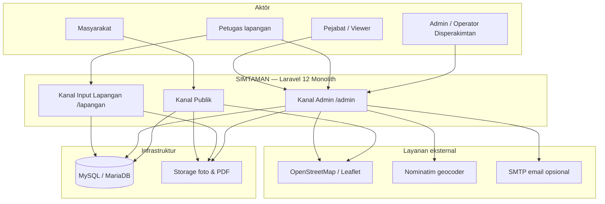
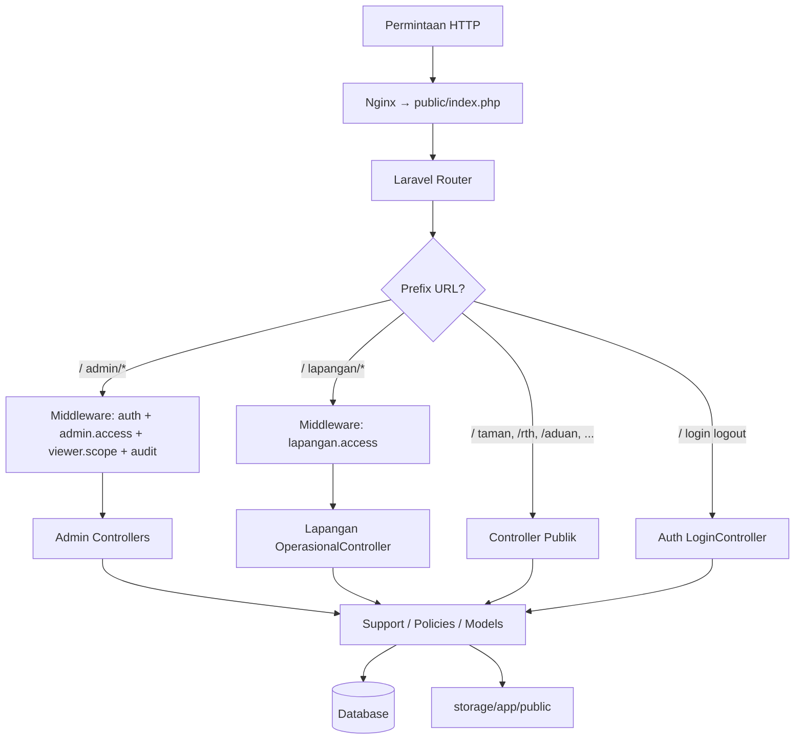
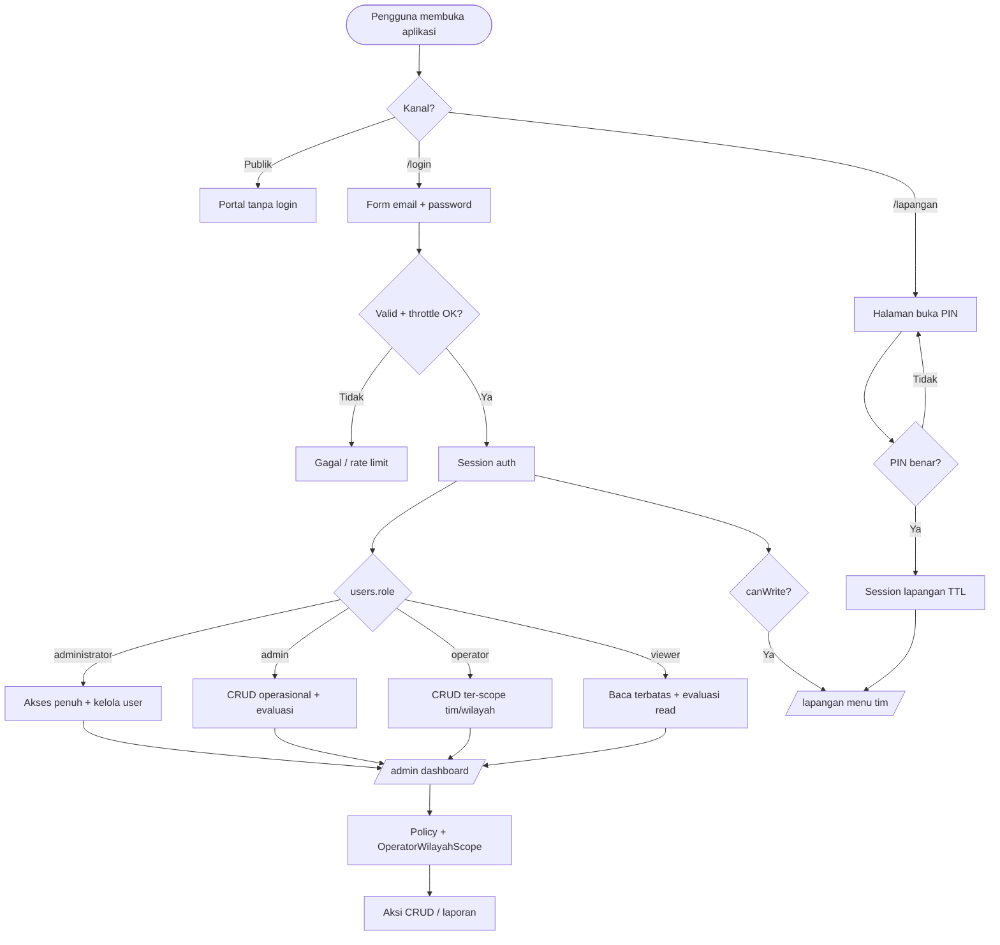
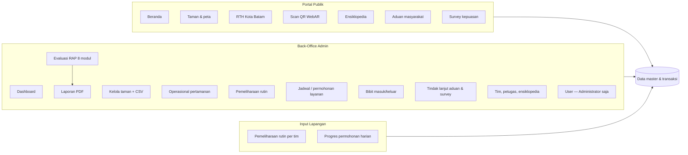
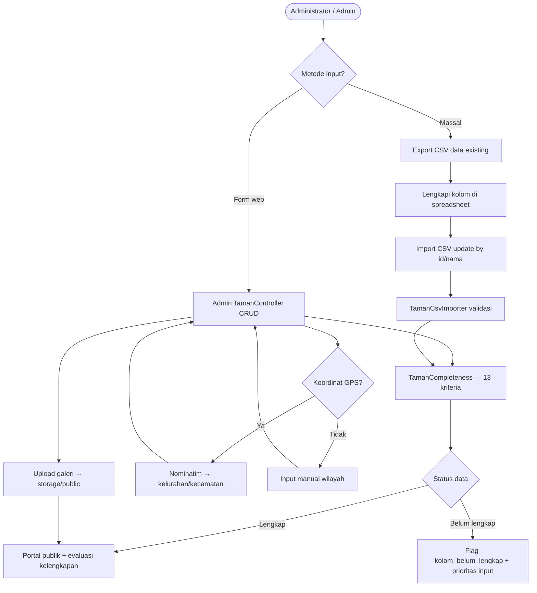
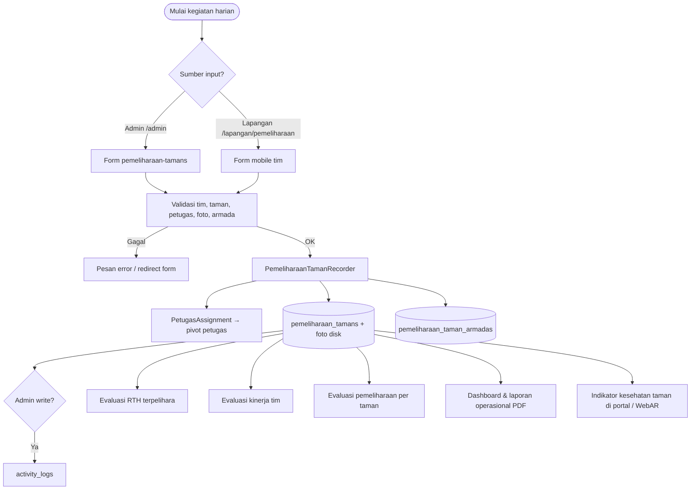
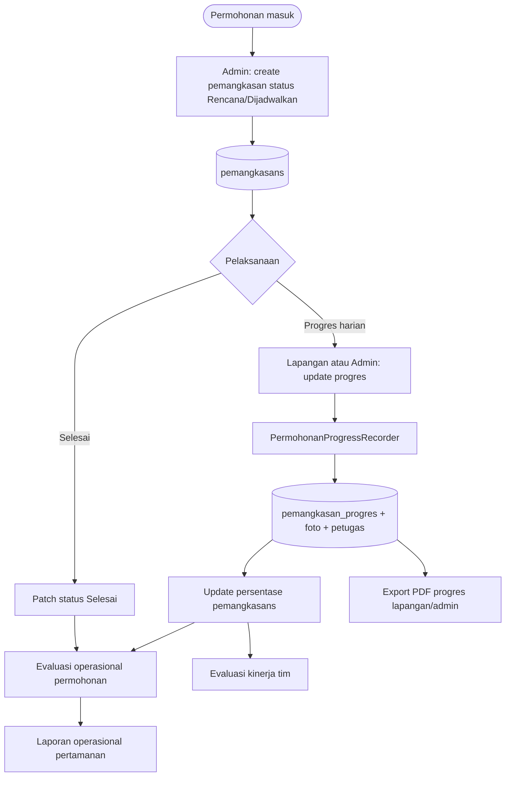
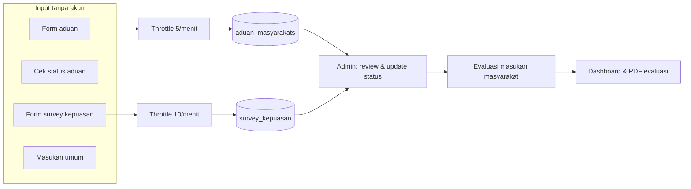
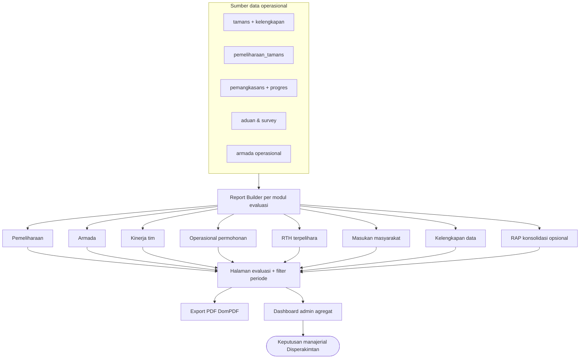
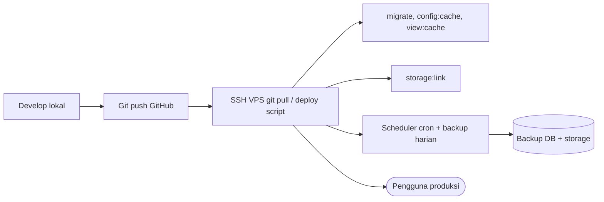

# Flowchart Rancangan Sistem SIMTAMAN

**Sistem Informasi Manajemen Pertamanan**  
Disperakimtan Kota Batam · Rancangan alur sistem · September 2026

Dokumen ini melengkapi [`ARSITEKTUR-SISTEM-SIMTAMAN.md`](ARSITEKTUR-SISTEM-SIMTAMAN.md) dengan diagram alur (flowchart) untuk kebutuhan KAK, desain sistem, dan sosialisasi pengguna.

**Lampiran KAK 1 halaman:** [`LAMPIRAN-KAK-FLOWCHART-SIMTAMAN-1-HALAMAN.md`](LAMPIRAN-KAK-FLOWCHART-SIMTAMAN-1-HALAMAN.md) · Word: `php scripts/generate-lampiran-flowchart-kak-docx.php`

> Diagram menggunakan [Mermaid](https://mermaid.js.org/). Pratinjau: VS Code/Cursor (Markdown Preview), GitHub, atau ekspor ke PNG via Mermaid Live Editor.

---

## 1. Konteks sistem (aktör & batas sistem)



---

## 2. Pembagian kanal akses (routing)



---

## 3. Alur autentikasi & otorisasi



---

## 4. Modul fungsional (peta menu)



---

## 5. Alur data profil taman (kelengkapan & CSV)



---

## 6. Alur pemeliharaan rutin operasional



---

## 7. Alur permohonan layanan (pemangkasan / jadwal)



---

## 8. Alur partisipasi masyarakat



---

## 9. Alur evaluasi & monitoring kinerja (RAP)



---

## 10. Alur input lapangan (PIN & sesi)

```mermaid
flowchart TD
    P([Petugas buka /lapangan]) --> U{Sudah unlock?}

    U -->|Tidak| F[Form PIN SIMTAMAN_LAPANGAN_PIN]
    F --> T{PIN valid?}
    T -->|Tidak| F
    T -->|Ya| S[Session lapangan_guest_unlocked_at]

    U -->|Ya| S
    U -->|User login operator/admin| S2[Middleware: canWrite]

    S --> MENU[Menu tim: pemeliharaan / permohonan]
    S2 --> MENU

    MENU --> OP[Submit form operasional]
    OP --> DB[(Database + upload foto)]

    MENU --> K[/lapangan/kunci]
    K --> END([Sesi PIN dihapus])
```

---

## 11. Alur deploy & operasional infrastruktur (ringkas)



---

## 12. Legenda peran (RBAC)

| Peran | Kanal utama | Kemampuan ringkas |
|-------|-------------|-------------------|
| **Masyarakat** | Publik | Baca informasi, aduan, survey |
| **Viewer** | Admin (terbatas) | Baca dashboard & evaluasi |
| **Operator (Pengawas)** | Admin + Lapangan | Input operasional scope tim |
| **Admin** | Admin | Kelola data operasional & evaluasi |
| **Administrator** | Admin | + user, tim, import CSV, log |
| **Petugas (tanpa akun)** | Lapangan (PIN) | Input pemeliharaan & progres |

---

## 13. Dokumen terkait

| Dokumen | Isi |
|---------|-----|
| `docs/ARSITEKTUR-SISTEM-SIMTAMAN.md` | Layer, middleware, keamanan |
| `docs/DESAIN-BASIS-DATA-SIMTAMAN.md` | ERD & tabel |
| `docs/KAK-SIMTAMAN.md` | Kerangka acuan kerja |
| `docs/deploy/VPS-BATAMGARDEN.md` | Referensi server produksi |

---

*Disperakimtan Kota Batam — SIMTAMAN*
