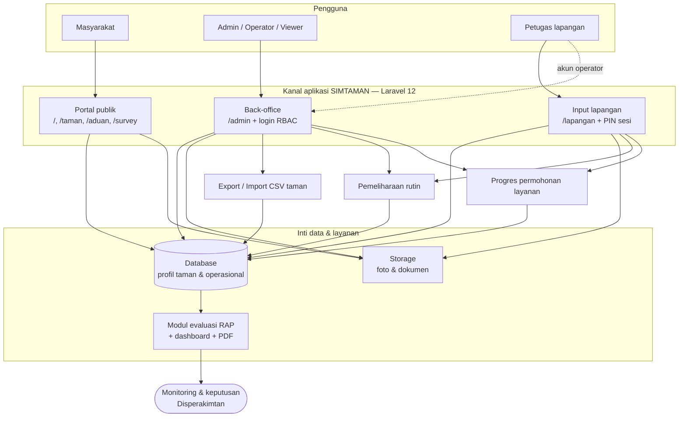

# Lampiran KAK — Flowchart Ringkas Rancangan Sistem SIMTAMAN (1 Halaman)

**Disperakimtan Kota Batam** · Lampiran diagram alur · Versi 1.0 · September 2026  

Versi lengkap (11 diagram): [`FLOWCHART-RANCANGAN-SISTEM-SIMTAMAN.md`](FLOWCHART-RANCANGAN-SISTEM-SIMTAMAN.md) · Word: `php scripts/generate-lampiran-flowchart-kak-docx.php`

---

## Diagram integrasi (satu lembar)

---

## Alur operasional utama (ringkas)

| Urut | Proses | Input | Keluaran |
|:--:|--------|-------|----------|
| 1 | **Profil taman** | Form admin atau CSV | Status lengkap, portal & peta |
| 2 | **Pemeliharaan rutin** | Admin atau lapangan (foto, petugas, tim) | Record operasional + evaluasi RTH |
| 3 | **Permohonan layanan** | Admin jadwal → progres harian lapangan | Persentase selesai + PDF |
| 4 | **Partisipasi publik** | Aduan & survey (tanpa login) | Tindak lanjut admin + evaluasi masukan |
| 5 | **Monitoring** | Agregasi data | Dashboard, 8 modul evaluasi, laporan PDF |

---

## Kanal & keamanan akses

| Kanal | Autentikasi | Fungsi utama |
|-------|-------------|--------------|
| Portal publik | Tidak | Informasi RTH/taman, WebAR QR, aduan, survey |
| `/admin` | Login session (Administrator / Admin / Operator / Viewer) | Kelola data, operasional, evaluasi, laporan |
| `/lapangan` | PIN `.env` atau user Operator/Admin | Input mobile pemeliharaan & progres layanan |

---

*Cetak lampiran ini sebagai satu halaman A4 landscape (disarankan) untuk KAK aksi perubahan / pengembangan SIMTAMAN.*
